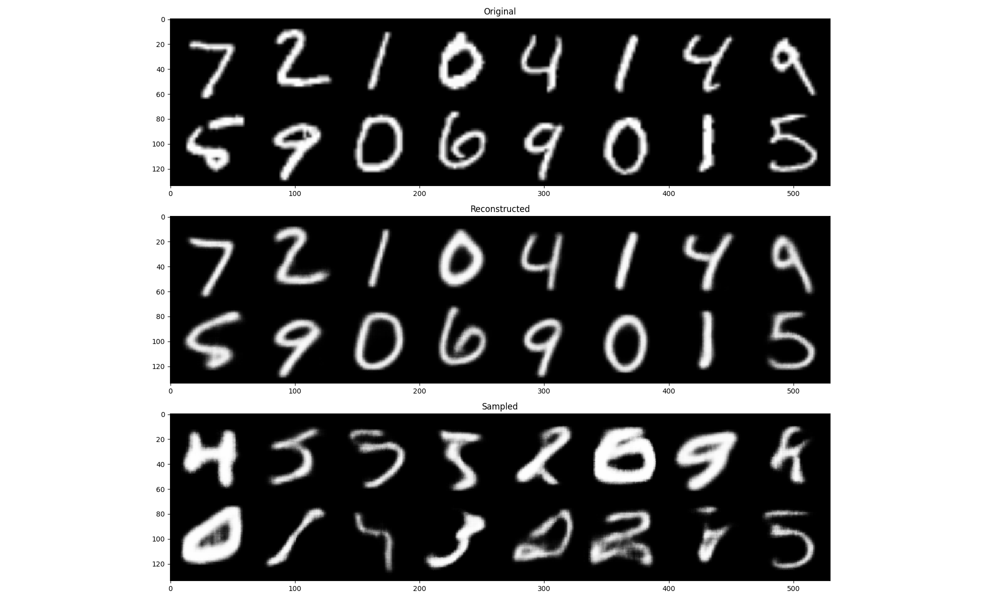

# vaelib

VAE library in PyTorch.

# Requirements

* Python == 3.7
* PyTorch == 1.6.0

Additional requirements for example codes.

* torchvision == 0.7.0
* matplotlib == 3.2.2
* tqdm == 4.46.1
* tensorboardX == 2.0

# Setup

Clone repository.

```bash
git clone https://github.com/rnagumo/vaelib.git
cd vaelib
```

Install the package in virtual env.

```bash
python3 -m venv .venv
source .venv/bin/activate
pip3 install --upgrade pip
pip3 install .
```

Or use [Docker](https://docs.docker.com/get-docker/) and [NVIDIA Container Toolkit](https://github.com/NVIDIA/nvidia-docker). You can run container with GPUs by Docker 19.03+.

```bash
docker build -t vaelib .
docker run --gpus all -it vaelib bash
```

Install other requirements for example code.

```bash
pip3 install torchvision==0.7.0 matplotlib==3.2.2 tqdm==4.46.1  tensorboardX==2.0
```

# Experiments

Run the shell script in `bin` directory. See the script for the experimental detail.

```bash
# Usage
bash bin/train.sh <model-name>

# Example
bash bin/train.sh betavae
```

# Results

|Model|Results|
|:-:|:-:|
|beta-VAE||

# Example codes

## Training

```python
import torch
from torch import optim
from torchvision import datasets, transforms

import vaelib


# Dataset
_transform = transforms.Compose([transforms.Resize(64), transforms.ToTensor()])
dataset = datasets.MNIST(
    root="./data/mnist", train=True, transform=_transform)
loader = torch.utils.data.DataLoader(dataset, shuffle=True, batch_size=32)

# Model
model = vaelib.BetaVAE(in_channels=1)
optimizer = optim.Adam(model.parameters())

for data, _ in loader:
    model.train()
    optimizer.zero_grad()

    loss_dict = model(data)
    loss = loss_dict["loss"].mean()
    loss.backward()
    optimizer.step()
```

## Qualitative Evaluation

```python
import matplotlib.pyplot as plt

import torch
from torchvision.utils import make_grid
from torchvision import datasets, transforms

import vaelib


# Dataset
_transform = transforms.Compose([transforms.Resize(64), transforms.ToTensor()])
dataset = datasets.MNIST(
    root="./data/mnist", train=False, transform=_transform)
loader = torch.utils.data.DataLoader(dataset, shuffle=False, batch_size=16)

# Model
model = vaelib.BetaVAE(in_channels=1)

# Reconstruct and sample
model.eval()
data, _ = next(iter(loader))
with torch.no_grad():
    recon = model.reconstruct(data)
    sample = model.sample(16)

# Plot
def gridshow(img):
    grid = make_grid(img)
    npgrid = grid.permute(1, 2, 0).numpy()
    plt.imshow(npgrid, interpolation="nearest")

plt.figure(figsize=(20, 12))

plt.subplot(311)
gridshow(data)
plt.title("Original")

plt.subplot(312)
gridshow(recon)
plt.title("Reconstructed")

plt.subplot(313)
gridshow(sample)
plt.title("Sampled")

plt.tight_layout()
plt.show()
```

# References

* I. Higgins *et al*., ["beta-VAE: Learning Basic Visual Concepts with a Constrained Variational Framework."](https://openreview.net/forum?id=Sy2fzU9gl) (ICLR 2017)
* C. Burgess *et al*., ["Understanding disentangling in beta-VAE"](http://arxiv.org/abs/1804.03599) (NeurIPS 2017)
